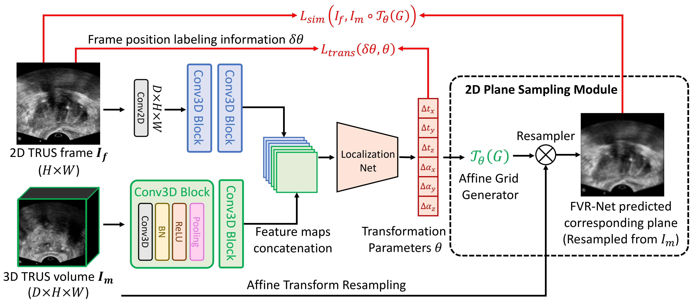

# Frame-to-Volume Registration Network (FVR-Net)
This repository contains the source code for MICCAI-2021 paper, entitled "End-to-end Ultrasound Frame to Volume Registration". 


## Introduction
In this work, the proposed FVR-Net can be trained to automatically register a single transrectal ultrasound (TRUS) 2D frame to a reconstructed 3D TRUS volume, which potentially enables instant frame localization during the prostate biopsy. The proposed FVR-Net utilizes a dual-branch feature extraction module to extract the information from TRUS frame and volume to estimate transformation parameters. To achieve efficient training and inference, we introduce a differentiable 2D slice sampling module which allows gradients backpropagating from an unsupervised image similarity loss for content correspondence learning. We include the training codes for the current version, and the repository is under active update. Please feel free to reach us if you have any questions or comments.

## Environment
- Set up your environment by anaconda, (**python3.7, torch 1.5.0+cu92**)

## Training
The model of FVR-Net is defined in networks/fvrnet.py. The network composes of two parrallel branches: one for extracting features for 2D frame image and one for 3D volumetric image. After the concatenation of extracted feature vectors, a 6 degree-of-freedom prediction is regressed. The spatial transformer component is used to generate [affine grids](https://github.com/DIAL-RPI/FVR-Net/blob/7a983c5b01aa451ac84148f39b47a4c39c30520a/networks/fvrnet.py#L601) for transforming the volumetric image. This differentiable design enables training the network with image similarity loss in an end-to-end way. Run the following command to train with FVR-Net:
```
CUDA_VISIBLE_DEVICES=0 python train_network.py
```

## Testing
TO DO

## Trouble Shooting
TO DO

## Citation
TO DO
